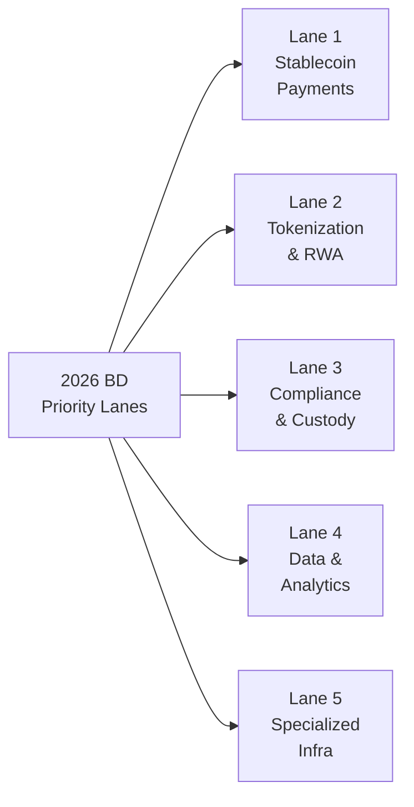
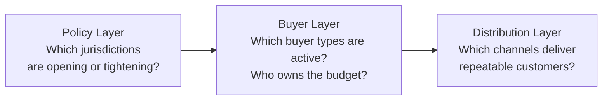

# Global Market Map

## The current value map

A useful BD lens is simple:

- Where is money moving?
- Where are regulated buyers appearing?
- Where does distribution already exist?
- Where can a team defend margin?

In 2026, the best answers are concentrated in a few lanes.

## Lane 1: Stablecoin payments and settlement

This is the most commercially proven lane in web3 today.

Why it matters:

- It solves a painful problem with visible economic value.
- Buyers already understand payments, treasury, FX, and settlement.
- It fits existing enterprise and fintech budgets.
- It connects crypto rails to non-crypto workflows.

What products sit here:

- cross-border B2B payouts
- merchant settlement
- contractor and creator payouts
- treasury management
- cards and card settlement
- on-ramp and off-ramp infrastructure
- liquidity routing and compliance tooling

Why this lane is durable:

- It benefits from network effects and distribution.
- Margins are not purely speculative; they come from fees, spreads, float, and workflow efficiency.
- It has enterprise expansion paths into reconciliation, reporting, treasury, and compliance.

What a BD should know:

- The economics of pre-funding versus just-in-time settlement
- The difference between a stablecoin issuer, payment orchestrator, and wallet infra provider
- The role of banking partners and fiat corridors
- Compliance constraints by jurisdiction

## Lane 2: Tokenization and RWA infrastructure

Tokenization is becoming real where it reduces distribution friction, operational cost, or market fragmentation.

The strongest subcategories:

- tokenized treasuries
- tokenized funds
- private credit rails
- security token infrastructure
- tokenized receivables and invoice flows
- digital transfer-agent style systems

What the market actually pays for:

- issuance workflow
- investor onboarding
- transfer restrictions
- custody and cap-table logic
- reporting and servicing
- secondary trading connectivity

What weak teams get wrong:

- they pitch "tokenization" as a feature without proving who gains distribution, liquidity, or operational efficiency
- they ignore legal wrapper and compliance cost
- they assume any asset can be made liquid just by putting it onchain

## Lane 3: Compliance, custody, and enterprise access

This is less glamorous and extremely important.

When institutions enter the market, they need a stack:

- custody
- policy controls
- wallet governance
- transaction monitoring
- travel rule support
- proof of reserves or proof of controls
- accounting and reporting
- fiat movement and banking coordination

The BD opportunity:

- Many customers do not want "crypto products."
- They want safe access, internal controls, and low-risk workflows.
- Selling trust, controls, and process maturity often closes faster than selling ideology.

## Lane 4: Data, analytics, and risk infrastructure

Data becomes valuable when it changes a decision.

Useful data businesses in web3 include:

- compliance and screening data
- wallet intelligence
- market surveillance
- treasury and balance sheet analytics
- validator and staking risk analytics
- token distribution intelligence

The trap:

- generic dashboards are easy to copy
- a data business needs workflow insertion, proprietary data, or compliance relevance

## Lane 5: Specialized infrastructure with attached distribution

Infrastructure still matters, but raw infrastructure without distribution is difficult.

Examples that can work:

- MPC wallet infrastructure with enterprise clients
- intent and routing layers embedded inside applications
- gaming, creator, or commerce rails with clear channel partners
- validator, staking, or restaking services tied to institutional distribution

The key condition:

- infrastructure wins when it is packaged into a business workflow, not when it is sold as technical elegance

## What is losing relative attention

These areas are not necessarily dead, but they are weaker as default BD priorities:

- generic L1 and L2 ecosystem BD without real application pull
- NFT-only consumer models
- exchange listing and token launch as the core business
- retail-only speculative acquisition
- protocol grants as a substitute for actual revenue

## How to think globally

A good global BD frame has three layers:

- Policy layer: Which jurisdictions are opening or tightening?
- Buyer layer: Which buyer types are active and what budget owner signs?
- Distribution layer: Which channels can take your product to repeatable customers?

This matters more than following crypto social media narratives.

## Where to spend your time

If you only had three domains to master deeply in 2026, choose:

- stablecoin payments
- tokenization and securities market structure
- regulated enterprise onboarding into digital assets
