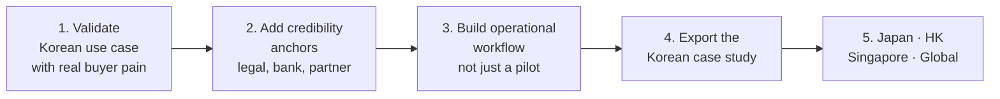

# Korea-Led Strategy

## Start from Korea's real advantages

Do not build your view of Korea around retail speculation alone.

Korea has stronger strategic value when you look at:

- globally connected exporters and service firms
- gaming and digital content ecosystems
- dense fintech and banking infrastructure
- sophisticated retail and mobile payments behavior
- policy evolution around digital assets and tokenization

## The Korea-led thesis

The strongest Korea-led web3 BD strategy is not "copy a U.S. token narrative and localize it."

It is:

- identify Korean industries with cross-border money flow
- use stablecoin and digital asset rails where they reduce friction
- attach regulated counterparties early
- build enterprise-grade trust and operations
- export the model to regional or global partners

## Best Korean opportunity areas

## 1. Cross-border B2B settlement

Why it fits Korea:

- export-heavy economy
- many firms deal with overseas suppliers, agencies, and contractors
- treasury efficiency and settlement speed are understandable value propositions

Target buyers:

- mid-market exporters
- trading firms
- agencies with international contractor networks
- commerce aggregators

## 2. Gaming, creator, and digital content payouts

Why it fits Korea:

- Korea already produces globally distributed digital content
- payout fragmentation is painful across countries and intermediaries
- web3 rails can be sold as payout infrastructure rather than as "crypto"

Target buyers:

- game studios
- creator networks
- music and content agencies
- fan platform operators

## 3. STO and tokenized financial products

Why it fits Korea:

- there is institutional familiarity with structured finance
- financial incumbents matter
- legal foundation is becoming more important than pure experimentation

Target buyers:

- securities firms
- asset managers
- infrastructure providers to regulated issuers

## 4. Enterprise digital asset access stack

Why it fits Korea:

- enterprises entering digital assets will want controlled exposure
- they will need custody, approvals, reporting, and policy support
- local trust and relationship management matter

Target buyers:

- corporates
- funds
- banks exploring infrastructure partnerships

## Korea-specific BD lessons

## Banks are not optional

In Korea, banking relationships are often the practical gate.

A solution that sounds good but cannot survive banking scrutiny is weaker than it looks.

## Enterprise trust matters more than crypto branding

For many Korean buyers, especially larger ones, "crypto-native" branding can raise procurement friction.

Translate the value into:

- settlement
- controls
- treasury
- digital asset operations
- infrastructure modernization

## Local references are powerful

A Korean buyer often cares about:

- who else in Korea is already using a similar workflow
- which law firm, bank, or compliance advisor is involved
- whether regulators and banking partners will understand the structure

## Distribution beats abstract strategy

Useful channels in Korea can include:

- banks
- securities firms
- fintechs
- enterprise software vendors
- large agency networks
- payment and commerce ecosystems

## Your Korea-outward expansion playbook

Use this order:

1. Validate the use case with a Korean buyer segment that already feels the pain.
2. Add one or two credibility anchors such as legal counsel, banking dialogue, or a regulated partner.
3. Build the operational workflow, not just the pilot.
4. Use the Korean case study to sell into Japan, Hong Kong, Singapore, or global counterparties with similar needs.

## Where Korean operators can win globally

- high-touch enterprise sales
- operational reliability
- regional relationship building
- fintech and payment partnerships
- structured, compliance-aware tokenization products

## A warning

Korea can also trap you into a domestic-only mindset.

Do not confuse:

- local noise with exportable advantage
- retail attention with enterprise demand
- partnership announcements with real distribution
