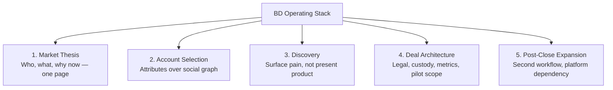
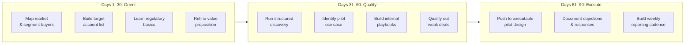

# BD Operator Manual

## What good BD actually is

Good BD is not just networking.

It is a disciplined system for:

- selecting the right market
- prioritizing accounts
- discovering real pain
- converting interest into an executable commercial motion
- coordinating legal, product, operations, and management to close

## The BD stack

You need five layers:

- market thesis
- account selection
- discovery
- deal architecture
- post-close expansion

## 1. Market thesis

Your thesis should fit on one page.

It must answer:

- which customer type has the pain
- which workflow you improve
- which buyer owns the budget
- why your timing is good now
- what makes your approach hard to replace

If your thesis is vague, your pipeline will be vague.

## 2. Account selection

Build your target list by attributes, not by social graph.

Useful account filters:

- cross-border activity
- digital asset readiness
- regulated footprint
- partnership velocity
- existing treasury or settlement pain
- history of fintech integrations

Then split accounts into:

- design partners
- lighthouse logos
- distribution partners
- fast-closing revenue accounts

These are not the same thing.

## 3. Discovery

The goal of discovery is not to present.

The goal is to surface:

- economic pain
- operational blocker
- compliance blocker
- timeline pressure
- internal champion
- decision chain

Strong discovery questions:

- What workflow today is slow, manual, or expensive?
- Which part of settlement, onboarding, or reconciliation breaks most often?
- What internal approval would block a new rail?
- If this worked, where would you measure the savings?
- Who signs if legal and compliance say yes?

## 4. Deal architecture

Most web3 deals fail because the commercial motion is not designed tightly enough.

For each opportunity, define:

- legal structure
- role of each party
- custody and fund flow
- compliance responsibilities
- success metrics
- pilot scope
- expansion triggers

A pilot without expansion logic is often theater.

## 5. Post-close expansion

The first contract is not the finish line.

Good post-close BD asks:

- What second workflow can be sold after the first win?
- Can volume commitments or corridor expansion be added?
- Can you become a platform dependency instead of a single feature vendor?

## Pipeline management

Track deals by risk, not by optimism.

Every deal should have a clear red flag list:

- no executive sponsor
- unclear legal posture
- no bankable fund flow
- low pain intensity
- long custom integration with weak revenue

If two or more red flags remain unresolved, downgrade the deal.

## Metrics that matter

- qualified pipeline by segment
- time from first meeting to technical validation
- time from technical validation to legal review
- conversion by partner type
- average implementation burden
- net revenue retention or expansion rate

## Working with product and legal

Weak BD throws a request over the wall.

Strong BD translates the account into crisp constraints:

- target customer
- exact workflow
- minimum viable feature set
- legal unknowns
- operational dependencies
- commercial upside

## Partnerships

Not every partner is valuable.

A good partner has at least one of:

- distribution
- regulatory cover
- liquidity
- banking access
- implementation leverage
- credibility with your buyer

If a partner has none of those, it is mostly logo theater.

## 30-60-90 day operator plan

## First 30 days

- map the market and segment the buyer types
- build a target account list
- learn the core regulatory questions
- refine the value proposition into plain business language

## Next 30 days

- run structured discovery
- identify one strong pilot use case
- build internal playbooks with legal and product
- qualify out weak opportunities

## Last 30 days

- push one or two opportunities to executable pilot design
- document objections and create response assets
- build a repeatable reporting cadence for management

## Rule of thumb

A strong BD operator is part salesperson, part strategist, part systems designer.

If you only do outreach, you are underpowered.
